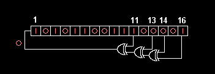

# CS 173 - Homework on GDB

Adapted from: https://inst.eecs.berkeley.edu/~cs61c/fa14/labs/03/

For parts III and IV, practice your gdb skills when debugging your code.

Good luck!

## I. Answer the following questions:

0. How do you compile C programs so that it will give useful information to gdb?
1. How do you pass command line arguments to a program when using gdb?
2. How do you set a breakpoint which only occurs when a set of conditions is true (e.g. when certain variables are a certain value)?
3. How do you execute the next line of C code in the program after stopping at a breakpoint?
4. If the next line of code is a function call, you'll execute the whole function call at once if you use your answer to #3. How do you tell GDB that you want to debug the code inside the function instead?
5. How do you resume the program after stopping at a breakpoint?
6. How can you see the value of a variable (or even an expression like 1+2) in gdb?
7. How do you configure gdb so it prints the value of a variable after every step?
8. How do you print a list of all variables and their values in the current function?
9. How do you exit out of gdb?

**Deliverables**
  1. Your answers to questions 1-10.

## II. Debugging a Buggy C Program

Consider the program ll_equal.c. Compile and run the program, and experiment with it. It will give you the following result:

```
$ gcc -g -o ll_equal ll_equal.c
$ ./ll_equal
equal test 1 result = 1
Segmentation fault
```

Start the ```gdb``` program, set a breakpoint in the ```ll_equal()``` function, and run the program.  When the debugger returns at the breakpoint, step through the instructions in the function line by line, and examine the values of the variables. Pay attention to the pointers a and b in the function. Are they always pointed to the right address? Find the bug and fix it.

**Deliverables**
  1. Explain the bug in ```ll_equal()``` and your fix to the function.
  2. Your *ll_equal.c* with your bug fix in *ll_equal()*

## III. Pointers and Structures in C

Complete the C program *ll_cycle.c*. Complete the function *ll_has_cycle()* to implement the following algorithm for checking if a singly-linked list has a cycle.

  1. Start with two pointers at the head of the list. We'll call the first one *tortoise* and the second one *hare*.
  2. Advance *hare* by two nodes. If this is not possible because of a null pointer, we have found the end of the list, and therefore the list is acyclic.
  3. Advance *tortoise* by one node. (A null pointer check is unnecessary. Why?)
  4. If *tortoise* and *hare* point to the same node, the list is cyclic. Otherwise, go back to step 2.

After you have correctly implemented *ll_has_cycle()*, the program you get when you compile ll_cycle.c will tell you that *ll_has_cycle()* agrees with what the program expected it to output.

**Deliverables**
  1. Your *ll_cycle.c* with the complete and correct implementation of *ll_has_cycle()*

## IV. Linear Feedback Shift Register (LFSR)

In this exercise, you will implement a *lfsr_calculate()* function to compute the next iteration of a linear feedback shift register (LFSR). Applications that use LFSRs are: Digital TV, CDMA cellphones, Ethernet, USB 3.0, and more! This function will generate pseudo-random numbers using bitwise operators. For some more background, read the [Wikipedia article on Linear feedback shift registers](https://en.wikipedia.org/wiki/Linear-feedback_shift_register). In *lfsr.c*, fill in the function *lfsr_calculate()* so that it does the following:

**Hardware diagram (see explanation below)**



**Explanation of the above diagram**

  * On each call to *lfsr_calculate()*, you will shift the contents of the register 1 bit to the right.
  * This shift is neither a logical shift or an arithmetic shift. On the left side, you will shift in a single bit equal to the Exclusive Or (XOR) of the bits originally in position 11, 13, 14, and 16.
  * The curved head-light shaped object is an XOR, which takes two inputs (a, b) and outputs a^b.
  * If you implemented *lfsr_calculate()* correctly, it should output all 65535 positive 16-bit integers before cycling back to the starting number.

After you have correctly implemented *lfsr_calculate()*, compile *lfsr.c* and run it. Your output should be similar to the following:

  ```bash
$ gcc -g -o lfsr lfsr.c
$ ./lfsr
My number is: 1
My number is: 5185
My number is: 38801
My number is: 52819
My number is: 21116
My number is: 54726
My number is: 26552
My number is: 46916
My number is: 41728
My number is: 26004
My number is: 62850
My number is: 40625
My number is: 647
My number is: 12837
My number is: 7043
My number is: 26003
My number is: 35845
My number is: 61398
My number is: 42863
My number is: 57133
My number is: 59156
My number is: 13312
My number is: 16285
 ... etc etc ...
Got 65535 numbers before cycling!
Congratulations! It works!
  ```

**Deliverables**
  1. Your *lfsr.c* with the complete and correct implementation of *ll_has_cycle()*
